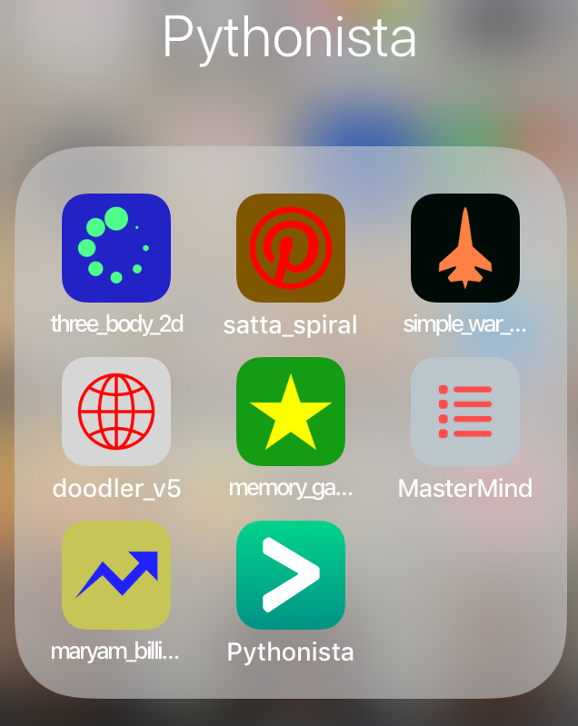
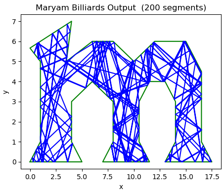
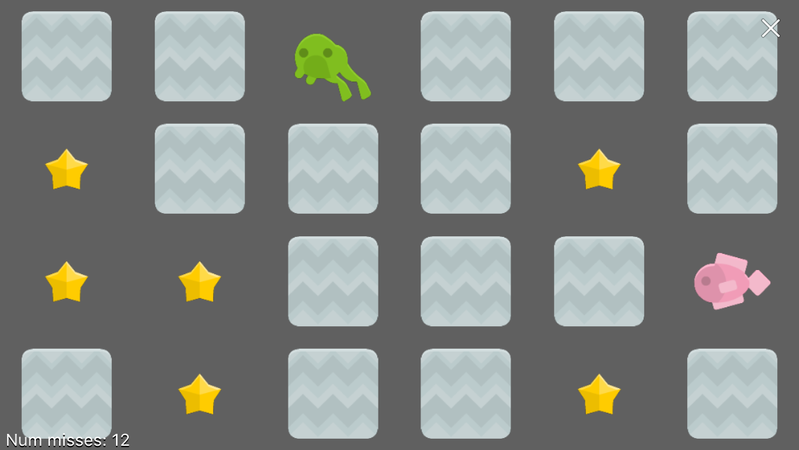

# Pythonista-bagatelles

<blockquote>    </blockquote>

Some very simple programs that run in Pythonista on iOS

## Second level

These programs can be run at a linux command line, e.g.: 
`$ python maryam_billiards.py`
