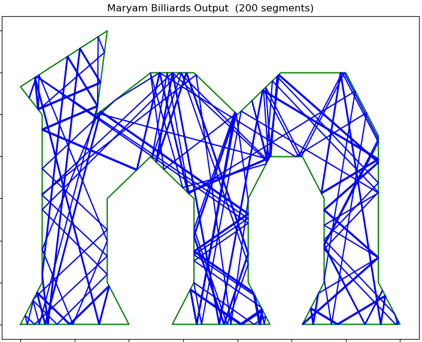
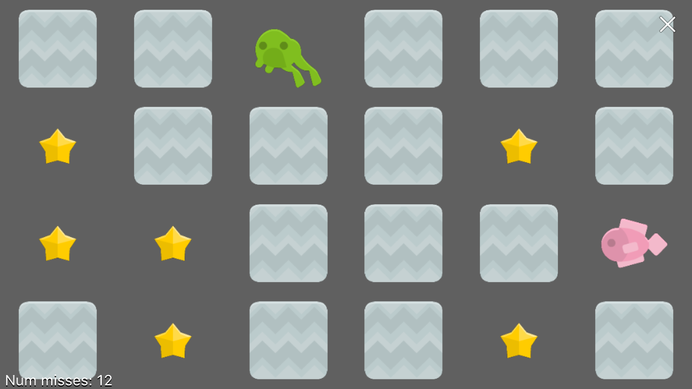
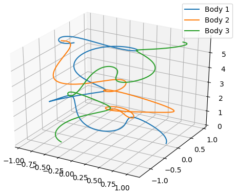

# Pythonista-bagatelles

<blockquote>  <table>
	<td align="center"> Maryam Billiards</td>
	<td align="center"> Memory Game</td>
	<td align="center"> Three-body 2D vs t</td>
</table></blockquote>

These are some very simple python programs that can be run in
the "Pythonista 3" app on iOS.  
Only the memory game *requires* Pythonista, 
all others can also be run on any typical python platform, 
e.g., by doing: `$ python maryam_billiards.py`

## Summary of the programs

The programs are listed here, most with examples of their output, and 
their high-school tutoring origins.

* diffy.py [[Diffy worksheet]](http://minds-in-bloom.com/diffy-fun-subtraction-game/) - a fun, simple activity... that can lead to a
4th degree polynomial?!

* doodler.py [[doodle plot]](images/doodler_out.png) - a simple LEGO doodling machine modeled with mid-point formula, basic-trig, etc.

* maryam_billiards.py [[bouncing in an "m"]](images/maryam_billiards_mout.png) - inspired by [Maryam Mirzakhani's](https://www.youcubed.org/resources/maryam/) mathematics

* mastermind.py [[solving Grn-Red-Wht-Blu]](images/mastermind_example.jpg) - kids and tutors like playing Mastermind, how good could one be?

* memory_game.py [[screen shot]](images/memory_game_screen.png) - this was inspired by playing the memory game with cards...  
 **Requires Pythonista** for its "scene" module. 

* satta_spiral.py [[satta spiral]](images/satta_spiral_plot.png) - Satta was marking her spinning whiteboard, what shapes can be created?

* simple_war_cards.py [[Cards vs time]](images/simple_war_cards_plot.png) - simulate the changes of fortune in the card game of War

* string_wave.py [[cute, but complicated!]](images/string_wave_waterfall.png) - model driven oscillations on a string (physics)

* sum_3_cards.py [[histogram]](images/sum_3_cards_plot.png) - make random numbers by adding the values of 3 playing cards

* three_body_2d.py [[x-y plot]](images/three_body_2d_out.png)  [[x-y vs time]](images/three_body_2d_vstime.png) - is three-body motion really complicated, even in 2D? yes!

- - -
### Installation on iPhone

. After getting "Pythonista 3" from the app store,
it is useful to install [StaSh](https://github.com/ywangd/stash) which provides a bash-like shell for Pythonista. 

. Once StaSh is installed and Pythonista is restarted, go to
the Pythonista home directory
(e.g., "This iPhone") and select: `launch-stash.py`. 

. Touch-hold the trianglular "run" icon and select "Run with Python 2.7" from the popup options; this starts up the StaSh window.

. At the StaSh command line execute the command:  
`git clone https://github.com/dan3dewey/Pythonista-bagatelles.git`   
to get this repository.

. Pythonista-bagatelles will now show as a folder in the Pythonista home directory.

- - -
